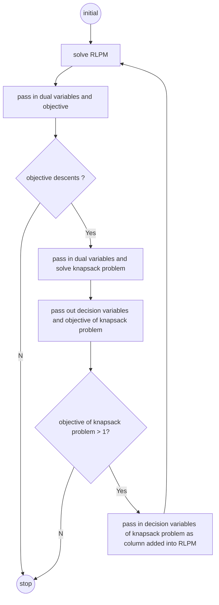

```mermaid
graph TB;
start((initial)) --> process1[solve RLPM];
process1[solve RLPM] --> value1[pass in dual variables and objective];
value1[pass in dual variables and objective] --> condition1{objective descents ?};
condition1{objective descents ?} --No--> stop((stop));
condition1{objective descents ?} --Yes--> process2[pass in dual variables and solve knapsack problem];
process2[pass in dual variables and solve knapsack problem] --> value2[pass out decision variables and objective of knapsack problem];
value2[pass out decision variables and objective of knapsack problem] --> condition2{objective of knapsack problem > 1?};
condition2{objective of knapsack problem > 1?} --No--> stop((stop));
condition2{objective of knapsack problem > 1?} --Yes--> process3[pass in decision variables of knapsack problem as column added into RLPM];
process3[pass in decision variables of knapsack problem as column added into RLPM] --> process1[solve RLPM];
```